# Form Complexity Heatmap

```mermaid
%%{init: {'theme':'base', 'themeVariables': { 'fontSize':'16px'}}}%%
graph LR

    FormConfig["FormConfig\n2133 controls"]
    style FormConfig fill:#FF4444,stroke:#333,stroke-width:2px
    FormSteerWiz["FormSteerWiz\n1299 controls"]
    style FormSteerWiz fill:#FF8C00,stroke:#333,stroke-width:2px
    FormAllSettings["FormAllSettings\n1080 controls"]
    style FormAllSettings fill:#FF8C00,stroke:#333,stroke-width:2px
    FormSteer["FormSteer\n900 controls"]
    style FormSteer fill:#FFD700,stroke:#333,stroke-width:2px
    FormGPS["FormGPS\n720 controls"]
    style FormGPS fill:#FFD700,stroke:#333,stroke-width:2px
    FormBuildTracks["FormBuildTracks\n501 controls"]
    style FormBuildTracks fill:#FFD700,stroke:#333,stroke-width:2px
    Form_Keys["Form_Keys\n217 controls"]
    style Form_Keys fill:#90EE90,stroke:#333,stroke-width:2px
    FormColorSection["FormColorSection\n191 controls"]
    style FormColorSection fill:#90EE90,stroke:#333,stroke-width:2px
    FormQuickAB["FormQuickAB\n167 controls"]
    style FormQuickAB fill:#90EE90,stroke:#333,stroke-width:2px
    ConfigVehicleControl["ConfigVehicleControl\n158 controls"]
    style ConfigVehicleControl fill:#90EE90,stroke:#333,stroke-width:2px
    FormBndTool["FormBndTool\n146 controls"]
    style FormBndTool fill:#90EE90,stroke:#333,stroke-width:2px
    FormFieldData["FormFieldData\n141 controls"]
    style FormFieldData fill:#90EE90,stroke:#333,stroke-width:2px
    FormGPSData["FormGPSData\n138 controls"]
    style FormGPSData fill:#90EE90,stroke:#333,stroke-width:2px
    FormButtonsRightPanel["FormButtonsRightPanel\n125 controls"]
    style FormButtonsRightPanel fill:#90EE90,stroke:#333,stroke-width:2px
    FormTramLine["FormTramLine\n120 controls"]
    style FormTramLine fill:#90EE90,stroke:#333,stroke-width:2px
```

## Complexity Legend
- **Red (2000+)**: Extremely complex - requires major refactoring
- **Orange (1000-1999)**: Very complex - needs careful planning
- **Yellow (500-999)**: Complex - moderate effort
- **Light Green (100-499)**: Moderate - straightforward migration
- **Green (<100)**: Simple - quick migration
