# FormBuildTracks - Structure Diagram

```mermaid
graph TD

    FormBuildTracks["FormBuildTracks"]
    style FormBuildTracks fill:#4682B4,stroke:#333,stroke-width:3px,color:#fff

    Panel_0["Panel: panelName\n0 controls"]
    FormBuildTracks --> Panel_0
    style Panel_0 fill:#87CEEB,stroke:#333

    Panel_1["Panel: panelMain\n0 controls"]
    FormBuildTracks --> Panel_1
    style Panel_1 fill:#87CEEB,stroke:#333

    Panel_2["Panel: flp\n0 controls"]
    FormBuildTracks --> Panel_2
    style Panel_2 fill:#87CEEB,stroke:#333

    Panel_3["Panel: panelCurve\n0 controls"]
    FormBuildTracks --> Panel_3
    style Panel_3 fill:#87CEEB,stroke:#333

    Panel_4["Panel: panelEditName\n0 controls"]
    FormBuildTracks --> Panel_4
    style Panel_4 fill:#87CEEB,stroke:#333

    Panel_5["Panel: panelKML\n0 controls"]
    FormBuildTracks --> Panel_5
    style Panel_5 fill:#87CEEB,stroke:#333

    Panel_6["Panel: panelChoose\n0 controls"]
    FormBuildTracks --> Panel_6
    style Panel_6 fill:#87CEEB,stroke:#333

    Panel_7["Panel: panelABLine\n0 controls"]
    FormBuildTracks --> Panel_7
    style Panel_7 fill:#87CEEB,stroke:#333

    Panel_8["Panel: panelAPlus\n0 controls"]
    FormBuildTracks --> Panel_8
    style Panel_8 fill:#87CEEB,stroke:#333

    Panel_9["Panel: panelLatLonPlus\n0 controls"]
    FormBuildTracks --> Panel_9
    style Panel_9 fill:#87CEEB,stroke:#333

    Panel_10["Panel: panelLatLonLatLon\n0 controls"]
    FormBuildTracks --> Panel_10
    style Panel_10 fill:#87CEEB,stroke:#333

    Panel_11["Panel: panelPivot\n0 controls"]
    FormBuildTracks --> Panel_11
    style Panel_11 fill:#87CEEB,stroke:#333

```

## Structure Statistics
- **Control Groups**: 12
- **Max Nesting Depth**: 1

### Control Type Distribution
- **Size**: 103
- **Point**: 102
- **Font**: 90
- **EventHandler**: 64
- **Button**: 50
- **Label**: 28
- **decimal**: 28
- **Panel**: 11
- **NudlessNumericUpDown**: 10
- **Padding**: 8
