# FormConfig - Structure Diagram

```mermaid
graph TD

    FormConfig["FormConfig"]
    style FormConfig fill:#4682B4,stroke:#333,stroke-width:3px,color:#fff

    Panel_0["Panel: panelLeftSideMenu\n0 controls"]
    FormConfig --> Panel_0
    style Panel_0 fill:#87CEEB,stroke:#333

    Panel_1["Panel: panelArduinoSubMenu\n0 controls"]
    FormConfig --> Panel_1
    style Panel_1 fill:#87CEEB,stroke:#333

    Panel_2["Panel: panelDataSourcesSubMenu\n0 controls"]
    FormConfig --> Panel_2
    style Panel_2 fill:#87CEEB,stroke:#333

    Panel_3["Panel: panelToolSubMenu\n0 controls"]
    FormConfig --> Panel_3
    style Panel_3 fill:#87CEEB,stroke:#333

    Panel_4["Panel: panelVehicleSubMenu\n0 controls"]
    FormConfig --> Panel_4
    style Panel_4 fill:#87CEEB,stroke:#333

    TabControl_5["TabControl: tab1\n0 controls"]
    FormConfig --> TabControl_5
    style TabControl_5 fill:#FFD700,stroke:#333

    TabPage_6["TabPage: tabSummary\n0 controls"]
    FormConfig --> TabPage_6
    style TabPage_6 fill:#FFA500,stroke:#333

    TabPage_7["TabPage: tabVConfig\n0 controls"]
    FormConfig --> TabPage_7
    style TabPage_7 fill:#FFA500,stroke:#333

    TabPage_8["TabPage: tabVAntenna\n0 controls"]
    FormConfig --> TabPage_8
    style TabPage_8 fill:#FFA500,stroke:#333

    GroupBox_9["GroupBox: labelAntOffset\n0 controls"]
    FormConfig --> GroupBox_9
    style GroupBox_9 fill:#98FB98,stroke:#333

    TabPage_10["TabPage: tabVDimensions\n0 controls"]
    FormConfig --> TabPage_10
    style TabPage_10 fill:#FFA500,stroke:#333

    TabPage_11["TabPage: tabVGuidance\n0 controls"]
    FormConfig --> TabPage_11
    style TabPage_11 fill:#FFA500,stroke:#333

    TabPage_12["TabPage: tabTConfig\n0 controls"]
    FormConfig --> TabPage_12
    style TabPage_12 fill:#FFA500,stroke:#333

    GroupBox_13["GroupBox: labelBoxAttachmen...\n0 controls"]
    FormConfig --> GroupBox_13
    style GroupBox_13 fill:#98FB98,stroke:#333

    TabPage_14["TabPage: tabTHitch\n0 controls"]
    FormConfig --> TabPage_14
    style TabPage_14 fill:#FFA500,stroke:#333

    TabPage_15["TabPage: tabToolOffset\n0 controls"]
    FormConfig --> TabPage_15
    style TabPage_15 fill:#FFA500,stroke:#333

    GroupBox_16["GroupBox: labelOverlapGap\n0 controls"]
    FormConfig --> GroupBox_16
    style GroupBox_16 fill:#98FB98,stroke:#333

    GroupBox_17["GroupBox: labelToolOffset\n0 controls"]
    FormConfig --> GroupBox_17
    style GroupBox_17 fill:#98FB98,stroke:#333

    TabPage_18["TabPage: tabToolPivot\n0 controls"]
    FormConfig --> TabPage_18
    style TabPage_18 fill:#FFA500,stroke:#333

    TabPage_19["TabPage: tabTSections\n0 controls"]
    FormConfig --> TabPage_19
    style TabPage_19 fill:#FFA500,stroke:#333

```

## Structure Statistics
- **Control Groups**: 39
- **Max Nesting Depth**: 1

### Control Type Distribution
- **Size**: 456
- **Point**: 455
- **Font**: 369
- **Label**: 201
- **EventHandler**: 193
- **decimal**: 134
- **Padding**: 70
- **NudlessNumericUpDown**: 58
- **CheckBox**: 52
- **Button**: 35
