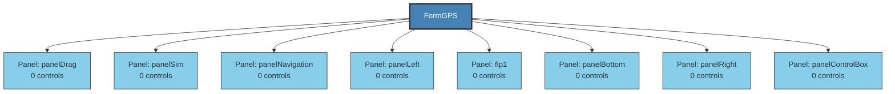

# FormGPS - Structure Diagram

## Structure Statistics
- **Control Groups**: 8
- **Max Nesting Depth**: 1

### Control Type Distribution
- **Size**: 170
- **EventHandler**: 135
- **Point**: 106
- **Font**: 101
- **Button**: 78
- **Padding**: 30
- **Label**: 7
- **TableLayoutPanel**: 4
- **GLControl**: 3
- **StatusStrip**: 3
