# FormSteer - Structure Diagram

```mermaid
graph TD

    FormSteer["FormSteer"]
    style FormSteer fill:#4682B4,stroke:#333,stroke-width:3px,color:#fff

    TabControl_0["TabControl: tabControl1\n0 controls"]
    FormSteer --> TabControl_0
    style TabControl_0 fill:#FFD700,stroke:#333

    TabPage_1["TabPage: tabPP\n0 controls"]
    FormSteer --> TabPage_1
    style TabPage_1 fill:#FFA500,stroke:#333

    TabPage_2["TabPage: tabStan\n0 controls"]
    FormSteer --> TabPage_2
    style TabPage_2 fill:#FFA500,stroke:#333

    TabPage_3["TabPage: tabSteer\n0 controls"]
    FormSteer --> TabPage_3
    style TabPage_3 fill:#FFA500,stroke:#333

    TabPage_4["TabPage: tabPPAdv\n0 controls"]
    FormSteer --> TabPage_4
    style TabPage_4 fill:#FFA500,stroke:#333

    TabPage_5["TabPage: tabGain\n0 controls"]
    FormSteer --> TabPage_5
    style TabPage_5 fill:#FFA500,stroke:#333

    Panel_6["Panel: panel2\n0 controls"]
    FormSteer --> Panel_6
    style Panel_6 fill:#87CEEB,stroke:#333

    Panel_7["Panel: panel1\n0 controls"]
    FormSteer --> Panel_7
    style Panel_7 fill:#87CEEB,stroke:#333

    TabControl_8["TabControl: tabSteerSettings\n0 controls"]
    FormSteer --> TabControl_8
    style TabControl_8 fill:#FFD700,stroke:#333

    TabPage_9["TabPage: tabSensors\n0 controls"]
    FormSteer --> TabPage_9
    style TabPage_9 fill:#FFA500,stroke:#333

    TabPage_10["TabPage: tabConfig\n0 controls"]
    FormSteer --> TabPage_10
    style TabPage_10 fill:#FFA500,stroke:#333

    TabPage_11["TabPage: tabSettings\n0 controls"]
    FormSteer --> TabPage_11
    style TabPage_11 fill:#FFA500,stroke:#333

    TabPage_12["TabPage: tabAlarm\n0 controls"]
    FormSteer --> TabPage_12
    style TabPage_12 fill:#FFA500,stroke:#333

    TabPage_13["TabPage: tabOnTheLine\n0 controls"]
    FormSteer --> TabPage_13
    style TabPage_13 fill:#FFA500,stroke:#333

    GroupBox_14["GroupBox: groupboxlabelGuid...\n0 controls"]
    FormSteer --> GroupBox_14
    style GroupBox_14 fill:#98FB98,stroke:#333

```

## Structure Statistics
- **Control Groups**: 15
- **Max Nesting Depth**: 1

### Control Type Distribution
- **Size**: 210
- **Point**: 205
- **Font**: 165
- **Label**: 125
- **EventHandler**: 65
- **decimal**: 24
- **HScrollBar**: 17
- **Padding**: 17
- **TabPage**: 10
- **NudlessNumericUpDown**: 10
