# FormSteerWiz - Structure Diagram

```mermaid
graph TD

    FormSteerWiz["FormSteerWiz"]
    style FormSteerWiz fill:#4682B4,stroke:#333,stroke-width:3px,color:#fff

    TabControl_0["TabControl: tabControl1\n0 controls"]
    FormSteerWiz --> TabControl_0
    style TabControl_0 fill:#FFD700,stroke:#333

    TabPage_1["TabPage: tabSteer\n0 controls"]
    FormSteerWiz --> TabPage_1
    style TabPage_1 fill:#FFA500,stroke:#333

    TabPage_2["TabPage: tabGain\n0 controls"]
    FormSteerWiz --> TabPage_2
    style TabPage_2 fill:#FFA500,stroke:#333

    TabPage_3["TabPage: tabStan\n0 controls"]
    FormSteerWiz --> TabPage_3
    style TabPage_3 fill:#FFA500,stroke:#333

    TabPage_4["TabPage: tabInt\n0 controls"]
    FormSteerWiz --> TabPage_4
    style TabPage_4 fill:#FFA500,stroke:#333

    Panel_5["Panel: panel2\n0 controls"]
    FormSteerWiz --> Panel_5
    style Panel_5 fill:#87CEEB,stroke:#333

    Panel_6["Panel: panel1\n0 controls"]
    FormSteerWiz --> Panel_6
    style Panel_6 fill:#87CEEB,stroke:#333

    TabControl_7["TabControl: tabWiz\n0 controls"]
    FormSteerWiz --> TabControl_7
    style TabControl_7 fill:#FFD700,stroke:#333

    TabPage_8["TabPage: tabStart\n0 controls"]
    FormSteerWiz --> TabPage_8
    style TabPage_8 fill:#FFA500,stroke:#333

    TabPage_9["TabPage: tabLoadDef\n0 controls"]
    FormSteerWiz --> TabPage_9
    style TabPage_9 fill:#FFA500,stroke:#333

    TabPage_10["TabPage: tabWheelBase\n0 controls"]
    FormSteerWiz --> TabPage_10
    style TabPage_10 fill:#FFA500,stroke:#333

    TabPage_11["TabPage: tabWheelTrack\n0 controls"]
    FormSteerWiz --> TabPage_11
    style TabPage_11 fill:#FFA500,stroke:#333

    TabPage_12["TabPage: tabAntennaDistance\n0 controls"]
    FormSteerWiz --> TabPage_12
    style TabPage_12 fill:#FFA500,stroke:#333

    TabPage_13["TabPage: tabAntennaHeight\n0 controls"]
    FormSteerWiz --> TabPage_13
    style TabPage_13 fill:#FFA500,stroke:#333

    TabPage_14["TabPage: tabAntennaOffset\n0 controls"]
    FormSteerWiz --> TabPage_14
    style TabPage_14 fill:#FFA500,stroke:#333

    TabPage_15["TabPage: tabButtonSwitch\n0 controls"]
    FormSteerWiz --> TabPage_15
    style TabPage_15 fill:#FFA500,stroke:#333

    TabPage_16["TabPage: tabA2DConv\n0 controls"]
    FormSteerWiz --> TabPage_16
    style TabPage_16 fill:#FFA500,stroke:#333

    TabPage_17["TabPage: tabMotorDriver\n0 controls"]
    FormSteerWiz --> TabPage_17
    style TabPage_17 fill:#FFA500,stroke:#333

    TabPage_18["TabPage: tabInvertRelays\n0 controls"]
    FormSteerWiz --> TabPage_18
    style TabPage_18 fill:#FFA500,stroke:#333

    TabPage_19["TabPage: tabDanfoss\n0 controls"]
    FormSteerWiz --> TabPage_19
    style TabPage_19 fill:#FFA500,stroke:#333

```

## Structure Statistics
- **Control Groups**: 35
- **Max Nesting Depth**: 1

### Control Type Distribution
- **Size**: 305
- **Point**: 303
- **Font**: 246
- **Label**: 154
- **EventHandler**: 113
- **Button**: 74
- **TabPage**: 30
- **HScrollBar**: 15
- **decimal**: 14
- **CheckBox**: 8
