# AgOpenGPS Form Navigation Graph

```mermaid
graph TD

    Controls[["Controls"]]
    style Controls fill:#90EE90,stroke:#333,stroke-width:2px
    FormAgShareSettings[["FormAgShareSettings"]]
    style FormAgShareSettings fill:#90EE90,stroke:#333,stroke-width:2px
    FormDialog[["FormDialog"]]
    style FormDialog fill:#90EE90,stroke:#333,stroke-width:2px
    FormEventViewer[["FormEventViewer"]]
    style FormEventViewer fill:#90EE90,stroke:#333,stroke-width:2px
    FormGPS[["FormGPS"]]
    style FormGPS fill:#90EE90,stroke:#333,stroke-width:2px
    FormGPSData[["FormGPSData"]]
    style FormGPSData fill:#90EE90,stroke:#333,stroke-width:2px
    FormPan[["FormPan"]]
    style FormPan fill:#90EE90,stroke:#333,stroke-width:2px
    FormSaving[["FormSaving"]]
    style FormSaving fill:#90EE90,stroke:#333,stroke-width:2px
    FormShiftPos[["FormShiftPos"]]
    style FormShiftPos fill:#90EE90,stroke:#333,stroke-width:2px
    FormWebCam[["FormWebCam"]]
    style FormWebCam fill:#90EE90,stroke:#333,stroke-width:2px

    FormGPS -->|Load| Form_First
    FormGPS -->|Load| FormNewProfile
    FormBoundary -->|Click| FormBuildBoundaryFromTracks
    FormEnterFlag -->|Click| FormFlags
    FormJob -->|Click| FormFilePicker
    FormJob -->|Click| FormDrivePicker
    FormJob -->|Click| FormAgShareDownloader
    FormNewProfile -->|Click| FormTimedMessage
    FormColor -->|Click| FormColorPicker
    FormColorSection -->|Click| FormColorPicker
    FormSteer -->|Click| FormSteerWiz
```

## Legend
- **Green boxes with double border**: Entry points (no parent forms)
- **Arrows**: Navigation triggered by events (Click, etc.)

**Total Forms**: 74
**Entry Points**: 64
**Navigations**: 16
