# AgOpenGPS UI State Machine

**Dynamic UI Behavior Analysis**

## Overview

- **Visibility Rules**: 312
- **Property Changes**: 2033
- **UI Modes**: 11
- **State Transitions**: 25

## UI Modes

The application operates in different UI modes, each with specific visible/hidden controls:

### panelTractorBrandsMode

**Description**: Mode triggered by: _vehicleConfig.Type

**Visible Controls** (3):
- panelTractorBrands
- panelHarvesterBrands
- panelArticulatedBrands

### btnMoveDnMode

**Description**: Mode triggered by: zoom

**Triggered by**: zoom

**Visible Controls** (4):
- btnMoveDn
- btnMoveUp
- btnMoveLeft
- btnMoveRight

**Hidden Controls** (4):
- btnMoveDn
- btnMoveUp
- btnMoveLeft
- btnMoveRight

### btnABDrawMode

**Description**: Merged mode: Mode triggered by: numberSets.Length > 2

**Triggered by**: numberSets, sender, is, button, mf

**Visible Controls** (1):
- btnABDraw

### lblTotalAreaMode

**Description**: Mode triggered by: mf.bnd.bndList.Count > 0

**Triggered by**: mf, bnd, bndList

**Visible Controls** (8):
- lblTotalArea
- lblAreaRemain
- lblTimeRemaining
- lblRemainPercent
- labelRemain
- lblActualRemain
- labelRemain2
- btnABDraw

**Hidden Controls** (7):
- lblTotalArea
- lblAreaRemain
- lblTimeRemaining
- lblRemainPercent
- lblActualRemain
- labelRemain2
- labelRemain

**Text Changes**:
- `labelRemain` → "gStr.gsRemain + ":""
- `labelRemain2` → "gStr.gsRemain + ":""
- `lblTimeRemaining` → "mf.fd.TimeTillFinished"
- `lblRemainPercent` → "mf.fd.WorkedAreaRemainPercentage"
- `lblTotalArea` → "mf.fd.AreaBoundaryLessInnersHectares"

### cboxIsVisibleMode

**Description**: Mode triggered by: indx > -1 && gTemp.Count > 0

**Triggered by**: indx, gTemp

**Visible Controls** (1):
- cboxIsVisible

**Hidden Controls** (1):
- cboxIsVisible

### panelMainMode

**Description**: Mode triggered by: selectedItem > -1

**Triggered by**: selectedItem

**Visible Controls** (2):
- panelName
- panelEditName

**Hidden Controls** (2):
- panelMain
- panelMain

### panelPivotMode

**Description**: Mode triggered by: mode

**Triggered by**: mode, waterPivot, cnt

**Visible Controls** (1):
- panelName

**Hidden Controls** (1):
- panelPivot

### panelCurveMode

**Description**: Merged mode: Mode triggered by: cnt > 2

**Triggered by**: cnt

**Visible Controls** (2):
- panelName
- panelMain

**Hidden Controls** (3):
- panelCurve
- panelName
- panelChoose

### btnPausePlayMode

**Description**: Mode triggered by: mf.curve.isMakingCurve

**Triggered by**: mf, curve, isMakingCurve

**Visible Controls** (1):
- btnPausePlay

### labelTurnSensorMode

**Description**: Merged mode: Mode triggered by: cboxEncoder.Checked

**Triggered by**: cboxEncoder, cboxPressureSensor, cboxCurrentSensor, checkbox

**Visible Controls** (7):
- labelTurnSensor
- lblPercentFS
- nudMaxCounts
- label61
- pbarSensor
- hsbarSensor
- lblhsbarSensor

**Hidden Controls** (7):
- pbarSensor
- hsbarSensor
- lblhsbarSensor
- nudMaxCounts
- labelTurnSensor
- lblPercentFS
- label61

### pboxSendSteerMode

**Description**: Mode triggered by: ((NudlessNumericUpDown)sender).ShowKeypad(this)

**Triggered by**: sender

**Visible Controls** (1):
- pboxSendSteer

## State Transitions

Transitions between UI modes:

```mermaid
stateDiagram-v2

    btnABDrawMode --> lblTotalAreaMode: JobClose
    btnMoveDnMode --> lblTotalAreaMode: timer1_Tick
    panelMainMode --> panelCurveMode: FormBoundary_Load
    panelMainMode --> panelCurveMode: btnReturn_Click
    panelMainMode --> panelPivotMode: btnAdd_Click
    btnABDrawMode --> lblTotalAreaMode: btnLoadBoundaryFromGE_Click
    panelMainMode --> panelCurveMode: btnDriveOrExt_Click
    panelMainMode --> panelCurveMode: btnGetKML_Click
    panelMainMode --> panelCurveMode: btnBingMaps_Click
    panelMainMode --> panelPivotMode: FormBuildTracks_Load
    panelMainMode --> panelPivotMode: btnNewTrack_Click
    panelMainMode --> panelPivotMode: btnDuplicate_Click
    panelMainMode --> panelCurveMode: btnEditName_Click
    panelPivotMode --> panelCurveMode: btnLatLonPivot_Click
    panelMainMode --> panelPivotMode: btnBCurve_Click
    panelMainMode --> panelPivotMode: btnEnter_AB_Click
    panelMainMode --> panelPivotMode: btnEnter_APlus_Click
    panelMainMode --> panelPivotMode: btnLoadABFromKML_Click
    panelMainMode --> panelPivotMode: btnEnter_LatLonLatLon_Click
    panelMainMode --> panelPivotMode: btnEnter_LatLonPlus_Click
    panelMainMode --> panelPivotMode: btnEnter_Pivot_Click
    panelMainMode --> panelPivotMode: btnCancelCurve_Click
    panelMainMode --> panelCurveMode: btnSaveEditName_Click
    panelMainMode --> panelPivotMode: FormQuickAB_Load
    labelTurnSensorMode --> pboxSendSteerMode: EnableAlert_Click
```

## State Variable Impact

State variables and the controls they affect:

### `mf` (affects 9 controls)

- btnABDraw
- lblTotalArea
- lblAreaRemain
- lblTimeRemaining
- lblRemainPercent
- labelRemain
- lblActualRemain
- labelRemain2
- btnPausePlay

### `bnd` (affects 8 controls)

- btnABDraw
- lblTotalArea
- lblAreaRemain
- lblTimeRemaining
- lblRemainPercent
- labelRemain
- lblActualRemain
- labelRemain2

### `bndList` (affects 8 controls)

- lblTotalArea
- lblAreaRemain
- lblTimeRemaining
- lblRemainPercent
- labelRemain
- lblActualRemain
- labelRemain2
- btnABDraw

### `cboxEncoder` (affects 7 controls)

- labelTurnSensor
- lblPercentFS
- nudMaxCounts
- pbarSensor
- hsbarSensor
- lblhsbarSensor
- label61

### `cboxPressureSensor` (affects 7 controls)

- labelTurnSensor
- lblPercentFS
- nudMaxCounts
- pbarSensor
- hsbarSensor
- lblhsbarSensor
- label61

### `cboxCurrentSensor` (affects 7 controls)

- labelTurnSensor
- lblPercentFS
- nudMaxCounts
- pbarSensor
- hsbarSensor
- lblhsbarSensor
- label61

### `checkbox` (affects 7 controls)

- labelTurnSensor
- lblPercentFS
- nudMaxCounts
- pbarSensor
- hsbarSensor
- lblhsbarSensor
- label61

### `cnt` (affects 5 controls)

- panelPivot
- panelName
- panelCurve
- panelMain
- panelChoose

### `zoom` (affects 4 controls)

- btnMoveDn
- btnMoveUp
- btnMoveLeft
- btnMoveRight

### `selectedItem` (affects 3 controls)

- panelMain
- panelName
- panelEditName

### `sender` (affects 2 controls)

- btnABDraw
- pboxSendSteer

### `result3` (affects 2 controls)

- btnABDraw
- pboxSendSteer

### `mode` (affects 2 controls)

- panelPivot
- panelName

### `waterPivot` (affects 2 controls)

- panelPivot
- panelName

### `numberSets` (affects 1 controls)

- btnABDraw

### `is` (affects 1 controls)

- btnABDraw

### `button` (affects 1 controls)

- btnABDraw

### `bndBeingMadePts` (affects 1 controls)

- btnABDraw

### `fieldCreated` (affects 1 controls)

- btnABDraw

### `polygon` (affects 1 controls)

- btnABDraw

