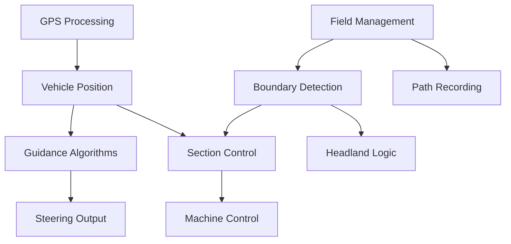

# Business Logic Extraction Plan for AgValoniaGPS

## Overview

This document provides a comprehensive methodology for systematically extracting business logic from the WinForms-based AgOpenGPS application and reorganizing it into a clean, testable architecture for AgValoniaGPS.

## The WinForms Problem

WinForms applications naturally encourage anti-patterns that tightly couple business logic with UI:

### Common Anti-Patterns in AgOpenGPS
1. **Event Handler Logic**: Button clicks directly calculate field areas, GPS positions, etc.
2. **Timer-Driven Business Logic**: Timer ticks updating both UI and performing calculations
3. **Form as State Container**: Forms holding domain data instead of models
4. **Control as Database**: ListBoxes, ComboBoxes storing actual data
5. **Cross-Form Dependencies**: Forms directly referencing each other for data
6. **OpenGL Render = Calculate**: Rendering loops performing business calculations
7. **Global Variables**: Static fields holding application state
8. **UI Thread Abuse**: All logic running on UI thread due to control access needs

## Extraction Methodology

### Phase 1: Discovery & Cataloging

#### Step 1: Static Analysis
Create an inventory of all WinForms files and their responsibilities:

```
Tool: Create a script to analyze:
- All *.cs files in GPS folder
- Count event handlers per form
- Identify timer components
- List all public properties/fields
- Map form interdependencies
```

#### Step 2: Business Logic Categories
Classify discovered logic into categories:

| Category | Description | Example from AgOpenGPS |
|----------|-------------|----------------------|
| **GPS Processing** | NMEA parsing, position calculation | FormGPS.cs ParseNMEA() |
| **Field Geometry** | Area calculation, boundary detection | FormGPS.cs CalculateArea() |
| **Guidance Algorithms** | AB line, curve following, steering | FormGPS.cs SteerAngleCalc() |
| **Section Control** | Section on/off logic, coverage mapping | FormGPS.cs DoSectionControl() |
| **Vehicle Kinematics** | Position prediction, turn compensation | FormGPS.cs UpdateFixPosition() |
| **Data Persistence** | Field saving/loading, settings | FormGPS.cs FileSaveField() |
| **Hardware Communication** | Serial/UDP messaging | FormGPS.cs SendPgnToLoop() |
| **Path Recording** | Breadcrumb trail, coverage tracking | FormGPS.cs AddBreadcrumb() |
| **Headland Management** | Headland creation, detection | FormHeadland.cs |
| **Boundary Operations** | Point-in-polygon, geofence | FormBoundary.cs |
| **UI State Management** | View modes, zoom levels | FormGPS.cs camera state |

#### Step 3: Dependency Mapping
Document dependencies between business logic components:



### Phase 2: Extraction Patterns

#### Pattern 1: Event Handler Extraction
**Before (WinForms):**
```csharp
private void btnABLine_Click(object sender, EventArgs e)
{
    // UI Logic
    btnABLine.Enabled = false;

    // Business Logic (EXTRACT THIS)
    double heading = Math.Atan2(B.easting - A.easting, B.northing - A.northing);
    ABLine.heading = heading;
    ABLine.origin = A;

    // More UI Logic
    lblABHeading.Text = heading.ToString();
}
```

**After (Clean Architecture):**
```csharp
// Service Layer
public class GuidanceService
{
    public ABLine CreateABLine(Position pointA, Position pointB)
    {
        var heading = CalculateHeading(pointA, pointB);
        return new ABLine(pointA, heading);
    }
}

// ViewModel
private void ExecuteCreateABLine()
{
    var abLine = _guidanceService.CreateABLine(PointA, PointB);
    ActiveABLine = abLine;
}
```

#### Pattern 2: Timer Logic Extraction
**Before (WinForms):**
```csharp
private void tmrWatchdog_Tick(object sender, EventArgs e)
{
    // Mixed UI and Business Logic
    if (DateTime.Now - lastGPSTime > TimeSpan.FromSeconds(2))
    {
        lblGPSStatus.BackColor = Color.Red; // UI
        isGPSConnected = false; // Business State
        StopAutoSteer(); // Business Logic
    }
}
```

**After (Clean Architecture):**
```csharp
// Service Layer
public class ConnectionMonitorService
{
    public event EventHandler<ConnectionStatus> ConnectionChanged;

    private void MonitorConnections()
    {
        if (DateTime.Now - _lastGpsTime > TimeSpan.FromSeconds(2))
        {
            UpdateConnectionStatus(ConnectionType.GPS, false);
            _autoSteerService.Disable();
        }
    }
}

// ViewModel subscribes to events
_connectionMonitor.ConnectionChanged += (s, status) =>
{
    GpsConnectionStatus = status;
};
```

#### Pattern 3: Render Loop Extraction
**Before (WinForms OpenGL):**
```csharp
private void openGLControl_Paint(object sender, PaintEventArgs e)
{
    // Calculation mixed with rendering
    double distanceFromLine = CalculateXTE(); // Business logic!

    // Draw based on calculation
    GL.Color3(distanceFromLine > 10 ? Color.Red : Color.Green);
    DrawVehicle();
}
```

**After (Clean Architecture):**
```csharp
// Service continuously calculates
public class GuidanceService
{
    public GuidanceState CurrentState { get; private set; }

    public void Update(Position currentPosition)
    {
        CurrentState = new GuidanceState
        {
            CrossTrackError = CalculateXTE(currentPosition),
            IsOffLine = Math.Abs(CrossTrackError) > 10
        };
    }
}

// Renderer only renders
private void RenderVehicle(GuidanceState state)
{
    var color = state.IsOffLine ? Color.Red : Color.Green;
    GL.Color3(color);
    DrawVehicle();
}
```

### Phase 3: Service Architecture Design

#### Core Services to Extract

```
AgValoniaGPS.Services/
├── GPS/
│   ├── IGpsDataService.cs         # GPS data processing
│   ├── INmeaParser.cs             # NMEA sentence parsing
│   └── IPositionService.cs        # Position calculations
├── Guidance/
│   ├── IGuidanceService.cs        # Main guidance orchestration
│   ├── IABLineService.cs          # AB line creation/following
│   ├── ICurveService.cs           # Curve line algorithms
│   ├── IContourService.cs         # Contour following
│   └── ISteeringService.cs        # Steering calculations
├── Field/
│   ├── IFieldService.cs           # Field management
│   ├── IBoundaryService.cs        # Boundary operations
│   ├── IHeadlandService.cs        # Headland management
│   └── IAreaCalculator.cs         # Area calculations
├── Machine/
│   ├── ISectionControlService.cs  # Section control logic
│   ├── IMachineService.cs         # Machine state management
│   ├── IRelayService.cs           # Relay control
│   └── IRateControlService.cs     # Application rate control
├── Vehicle/
│   ├── IVehicleService.cs         # Vehicle state & kinematics
│   ├── ISteerAngleService.cs      # Steer angle calculation
│   └── ITurnCompensation.cs       # Turn compensation
├── Recording/
│   ├── IPathRecorder.cs           # Path recording
│   ├── ICoverageTracker.cs        # Coverage mapping
│   └── IFlagService.cs            # Flag/marker management
└── Hardware/
    ├── IHardwareManager.cs        # Hardware orchestration
    ├── IPgnMessageService.cs      # PGN messaging
    └── IModuleMonitor.cs          # Module status tracking
```

### Phase 4: Feature Extraction Roadmap

#### Extraction Priority Order
Extract features in dependency order to maintain working system:

##### Wave 1: Foundation (No Dependencies)
1. **GPS Processing**
   - Extract NMEA parsing
   - Extract position calculations
   - Extract coordinate conversions
   - Test: Can display GPS position

2. **Basic Math/Geometry**
   - Extract distance calculations
   - Extract angle calculations
   - Extract unit conversions
   - Test: Unit tests pass

##### Wave 2: Core Domain (Depends on Wave 1)
3. **Vehicle Model**
   - Extract vehicle configuration
   - Extract kinematics calculations
   - Extract antenna offset logic
   - Test: Vehicle position updates correctly

4. **Field Model**
   - Extract field data structure
   - Extract boundary representation
   - Extract area calculations
   - Test: Can load/save fields

##### Wave 3: Guidance (Depends on Waves 1-2)
5. **AB Line Logic**
   - Extract AB line creation
   - Extract line following calculations
   - Extract offset/nudge logic
   - Test: Can create and follow AB line

6. **Steering Algorithms**
   - Extract Stanley algorithm
   - Extract Pure Pursuit algorithm
   - Extract integral terms
   - Test: Produces correct steer angles

##### Wave 4: Field Operations (Depends on Waves 1-3)
7. **Boundary Operations**
   - Extract point-in-polygon
   - Extract boundary creation
   - Extract geofence logic
   - Test: Boundary detection works

8. **Section Control**
   - Extract section state management
   - Extract look-ahead logic
   - Extract coverage mapping
   - Test: Sections turn on/off correctly

##### Wave 5: Advanced Features (Depends on Waves 1-4)
9. **Curve Lines**
   - Extract curve creation
   - Extract curve following
   - Test: Can follow curves

10. **Headland Management**
    - Extract headland creation
    - Extract headland detection
    - Test: Headland turns work

11. **Contour Following**
    - Extract contour logic
    - Extract smoothing algorithms
    - Test: Maintains consistent offset

##### Wave 6: Hardware I/O (Can parallel with others)
12. **PGN Messaging**
    - Extract message creation
    - Extract message parsing
    - Test: Messages format correctly

13. **Module Communication**
    - Extract handshake logic
    - Extract timeout monitoring
    - Test: Detects disconnections

### Phase 5: Extraction Process Per Feature

For each feature extraction:

#### 1. Analysis Step
```markdown
## Feature: [Feature Name]

### Current Location
- Primary File: FormGPS.cs (lines 1234-1567)
- Supporting Files:
  - Classes/CABLine.cs
  - Helpers/GeometryHelpers.cs

### Identified Logic
- [ ] Line intersection calculation (line 1240)
- [ ] Offset calculation (line 1290)
- [ ] State management (line 1340)

### Dependencies
- Requires: Vehicle position, Field boundaries
- Provides: Guidance line, Cross-track error

### Test Cases Needed
- [ ] Create line from two points
- [ ] Calculate perpendicular distance
- [ ] Handle edge cases (parallel lines, etc)
```

#### 2. Extraction Step
1. Create service interface in AgValoniaGPS.Services
2. Create model classes in AgValoniaGPS.Models
3. Implement service with extracted logic
4. Create unit tests
5. Wire up in DI container
6. Update ViewModel to use service
7. Remove old code from reference

#### 3. Verification Step
- Unit tests pass
- Integration test with UI works
- Behavior matches original
- No UI logic in service
- No business logic in ViewModel

### Phase 6: Testing Strategy

#### Unit Testing Approach
For each extracted service:

```csharp
[TestClass]
public class ABLineServiceTests
{
    [TestMethod]
    public void CreateABLine_ValidPoints_CalculatesCorrectHeading()
    {
        // Test pure business logic
    }

    [TestMethod]
    public void CalculateXTE_VariousPositions_ReturnsCorrectDistance()
    {
        // Test algorithm correctness
    }
}
```

#### Integration Testing
```csharp
[TestClass]
public class GuidanceIntegrationTests
{
    [TestMethod]
    public void FullGuidanceLoop_SimulatedGPS_ProducesSteerCommands()
    {
        // Test service orchestration
    }
}
```

## Extraction Tracking Sheet

### Feature Extraction Status Template

| Feature | WinForm Location | Service Created | Tests Written | UI Connected | Status |
|---------|-----------------|-----------------|---------------|--------------|--------|
| NMEA Parser | FormGPS.cs:2150 | ✅ NmeaParserService | ⏳ | ✅ | Complete |
| Position Calc | FormGPS.cs:2450 | ✅ GpsService | ⏳ | ✅ | Complete |
| AB Line Create | FormGPS.cs:3200 | ⏳ | ⏳ | ⏳ | Pending |
| Section Control | FormGPS.cs:4500 | ⏳ | ⏳ | ⏳ | Pending |
| Boundary Check | FormBoundary.cs | ✅ BoundaryService | ⏳ | ✅ | Complete |

## Critical Extraction Rules

### DO NOT:
1. ❌ Copy code wholesale - Rewrite with clean patterns
2. ❌ Mix UI concerns in services - Services should be UI-agnostic
3. ❌ Use WinForms types in services - No System.Windows.Forms references
4. ❌ Access services from models - Models are POCOs
5. ❌ Create circular dependencies - Maintain clear hierarchy

### ALWAYS:
1. ✅ Write interface first - Define contract before implementation
2. ✅ Create unit tests immediately - Test the extracted logic
3. ✅ Use dependency injection - No 'new' for services
4. ✅ Keep services stateless when possible - Immutable operations
5. ✅ Document the extraction - Note what was extracted from where

## Validation Checklist

Before considering a feature "extracted":

- [ ] All business logic removed from UI layer
- [ ] Service has interface definition
- [ ] Service registered in DI container
- [ ] Unit tests achieve >80% coverage
- [ ] No WinForms dependencies in service
- [ ] ViewModel correctly orchestrates service
- [ ] UI updates via data binding only
- [ ] Original functionality preserved
- [ ] Performance is acceptable
- [ ] Code is documented

## Migration Patterns Reference

### Pattern A: Simple Calculation Extraction
```csharp
// Before: In button click
var area = width * height * 0.0001; // to hectares

// After: In service
public double CalculateAreaHectares(double widthMeters, double heightMeters)
{
    return widthMeters * heightMeters * MetersSquaredToHectares;
}
```

### Pattern B: Stateful Service Extraction
```csharp
// Before: Form fields
private bool isFollowingAB = false;
private double abHeading = 0;

// After: Service with state
public class GuidanceService
{
    private GuidanceMode _mode = GuidanceMode.None;
    private ABLine _activeLine;

    public void StartABGuidance(ABLine line) { }
    public void StopGuidance() { }
}
```

### Pattern C: Event-Driven Extraction
```csharp
// Before: Timer tick doing work
private void timer_Tick()
{
    CheckTimeout();
    UpdateDisplay();
}

// After: Service with events
public class ConnectionMonitor
{
    public event EventHandler<bool> ConnectionChanged;

    private void Monitor() // Background task
    {
        if (timeout) ConnectionChanged?.Invoke(this, false);
    }
}
```

## Success Metrics

Track extraction progress:

1. **Code Metrics**
   - Lines of code in Forms: Target -90%
   - Service code coverage: Target >80%
   - Cyclomatic complexity: Target <10 per method

2. **Architecture Metrics**
   - UI/Business separation: 100%
   - Testable services: 100%
   - DI compliance: 100%

3. **Quality Metrics**
   - Bug rate: Lower than original
   - Performance: Equal or better
   - Memory usage: Equal or better

## Next Steps

1. Begin with Wave 1 extractions (GPS Processing)
2. Create service interfaces
3. Write tests for expected behavior
4. Extract logic into services
5. Connect to UI via ViewModels
6. Validate against original behavior
7. Document extracted features
8. Move to next wave

---

*This extraction plan ensures systematic migration from WinForms to clean architecture while maintaining functionality and enabling cross-platform development.*